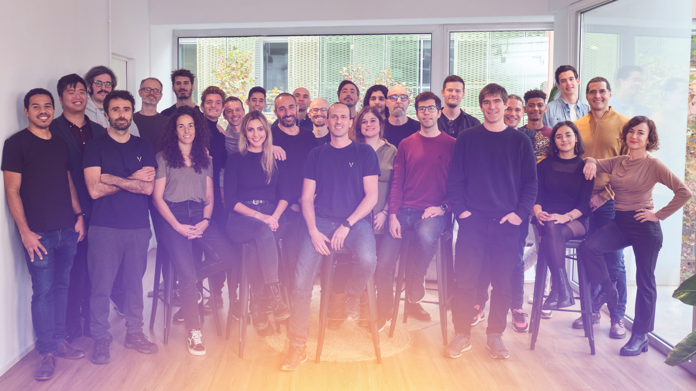

# 👩‍💻 Developer Groups / Freeverse

In our strong commitment to decentralization, we're harnessing the <mark style="color:green;">**collective prowess of independent developer groups**</mark> contributing to LAOS.&#x20;

LAOS firmly believes in building its technology with the active participation and expertise of these independent groups, fully acknowledging the <mark style="color:green;">**immeasurable value they can bring to the ecosystem**</mark>. By entrusting the development efforts and possibilities to a diverse array of innovative groups, we are creating the optimal environment for LAOS to emerge as the leading solution in the dynamic NFT space.&#x20;

To enable this decentralized contribution environment, <mark style="color:green;">**LAOS has set aside**</mark> [**40% of its token for community incentives**](../tokenomics/token-distribution.md#laos-token-allocation). These tokens will be distributed through comprehensive programs that include grants and payouts for community contributions. By focusing on community empowerment, we aim to foster a flourishing ecosystem of smart builders, ensuring that the tokens are distributed widely among those who contribute to the growth and success of LAOS.

## Freeverse - Key contributors

The <mark style="color:green;">**most prominent group in this collaboration currently is Freeverse**</mark>. The company constructed the <mark style="color:green;">**Living Asset Ecosystem**</mark>, which, at launch, can <mark style="color:green;">**seamlessly transition into LAOS**</mark>. This flexible setup combines diverse developer capabilities, fostering innovation and accelerating progress in the dynamic NFT space.

As a prominent <mark style="color:green;">**founding member of the LAOS Foundation**</mark>, Freeverse will be instrumental in both initially developing and promoting LAOS. The organization has made a firm commitment to preserving <mark style="color:green;">**LAOS' complete independence**</mark> and ensuring that it is entirely community-owned and decentralized.

<figure><figcaption></figcaption></figure>

## Freeverse - Company info&#x20;

Freeverse is shifting the benchmark of NFTs and digital ownership to one of <mark style="color:green;">**User-Generated Value(TM)**</mark>. Freeverse’s vision is to imagine and power the future of digital ownership as a common good for people everywhere.

Founded in 2019 by tech-industry veterans, Freeverse is a privately held, for-profit, company that has raised over $13M in funding from leading investors, such as <mark style="color:green;">**Earlybird**</mark> and <mark style="color:green;">**Target**</mark> <mark style="color:green;">**Global**</mark>, and now boasts an international team of more than 30, built around a strong R\&D core.&#x20;

Its existing [<mark style="color:green;">**Living Assets Layer-2**</mark>](https://dev.livingassets.io/)<mark style="color:green;">**, platform API, and SaaS tools**</mark> are already being used by reference brands such as <mark style="color:green;">**Cupra**</mark> and <mark style="color:green;">**Mediapro**</mark>, as well as multiple videogames and brands.&#x20;

##

## **Founding Team of Freeverse**

**Alun Evans**

Co-Founder & Chief Executive Officer

[LinkedIn](https://www.linkedin.com/in/alun-evans/)

With 20 years of experience in the tech industry for entertainment, Alun has a passion for building teams with a strong collaborative culture, that is focused on creating products that solve genuine problems. Previously, he was CEO of Shar3d.io (collaborative 3D applications on the web), CTO of Bodypal.com (virtual garment and fitting service), and Director of Barcelona World Race - THE GAME, the first-ever video game that allowed players to compete in a simultaneous real-world sporting event. Alun has a Ph.D. in Medical Physics from University College London.

**Toni Mateos**

Co-Founder & Chief Technology Officer

[LinkedIn](https://www.linkedin.com/in/toni--mateos/)&#x20;

Toni is the co-founder and CTO of Freeverse. He was the co-creator of Dolby Atmos, from conception to product, a surround sound technology that has reached tens of millions of users in 90+ countries. In 2009, he also co-founded the cutting-edge Cinema Technology company ImmSound, acquired by Dolby Laboratories in 2012. After the acquisition, he became Director of Research at Dolby Laboratories. In 2019, he left Dolby to co-found Freeverse, with the vision of using blockchain technology to bring digital ownership to the mainstream.

Toni holds a degree in Quantum Gravity (U. Barcelona), a Ph.D. in Mathematical Physics (String Theory, Imperial College London), a Postgrad in Blockchain Technologies (Polytechnic University of Catalonia), has 17 years of experience leading R\&D teams in the entertainment tech industry, and is author of 30+ patents in various technological fields. He loves building hard tech, especially the human side, building teams from scratch, attracting international young and senior talent, and helping extremely different personalities grow and converge around the joy of building something together.

**Fernando Estalella**

Co-Founder & Chief Operating/Financial Officer

[LinkedIn](https://www.linkedin.com/in/fernando-estalella-2433b046/)

Ferran is the co-founder and COO of Freeverse. Previously, he worked at Accenture developing System Integrations projects in the areas of technology and strategy for the Telecom industry, and in Digital Transformation at the Accenture Innovation Center in Barcelona.

Ferran is passionate and enthusiastic about delivering innovation to clients and inspiring people to keep innovating. He is a team player who loves to collaborate and share ideas with others.\
Ferran is an industrial engineer with a postgraduate degree in Blockchain Technologies from the Polytechnic University of Catalonia.\

**Alessandro Siniscalchi**

Co-Founder & Head of Engineering

[LinkedIn](https://www.linkedin.com/in/asiniscalchi/?originalSubdomain=es)

Alessandro is the co-founder and Head of Engineering at Freeverse. He is a computer engineer with more than 15 years of experience in the deployment of mission-critical systems on projects ranging from blockchain, industrial control of space observatories, military fighter jets, cinema sound, and audio signal processing. He has a strong focus on design, software quality, and agile development methodologies.&#x20;


**Get in touch:** Looking to dive deeper into the Freeverse project? Reach out to the Freeverse team at [info@freeverse.com](mailto:info@freeverse.com).

