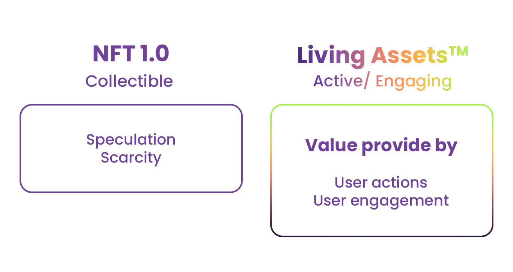
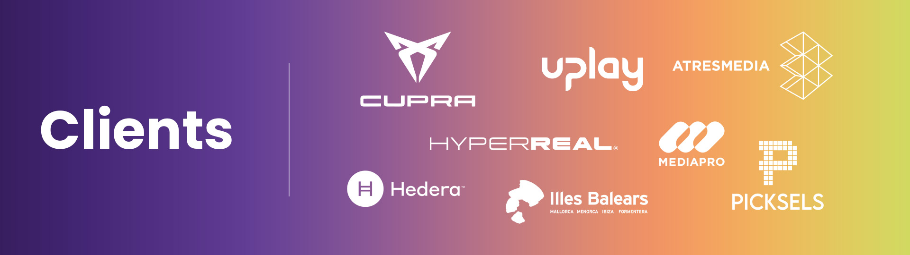
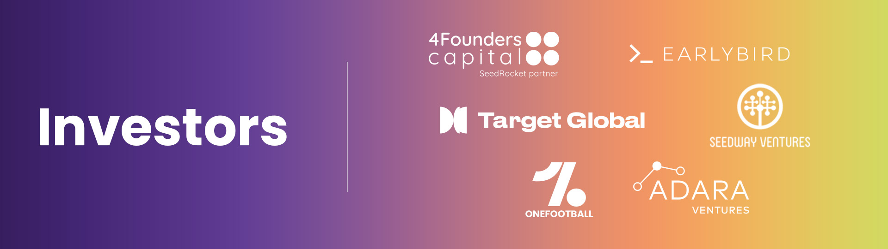
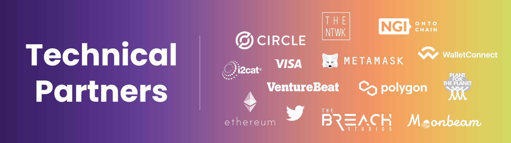

# ✨ Living Assets Layer-2

<figure><figcaption></figcaption></figure>

### Living Assets Layer-2 by Freeverse

Companies, brands and videogames are already live & building amazing products on the Living Assets Layer-2.

<mark style="color:green;">**LAOS will boost them**</mark>

LAOS will replace the underlying technology behind the currently existing Living Assets Layer-2, and greatly extend its capabilities.&#x20;

Existing clients, and their assets, will be offered the possibility to seamlessly migrate to LAOS, guaranteeing usage from day 1.

<figure><figcaption></figcaption></figure>

### Comprehensive Suite of web3 Products

The existing Living Assets Layer-2 already comes with a comprehensive suite of web3 products that facilitate mainstream adoption. These will continue to operate on LAOS from day 1:

* Customizable Web & Mobile <mark style="color:green;">**Marketplaces**</mark> that highlight asset evolution&#x20;
* Dedicated <mark style="color:green;">**Payment**</mark> <mark style="color:green;">**Gateways**</mark> in FIAT, native crypto & ERC20s.&#x20;
* <mark style="color:green;">**Social**</mark> <mark style="color:green;">**Media**</mark> <mark style="color:green;">**Evolvers**</mark> that connect assets to users actions in the web2 world.&#x20;
* <mark style="color:green;">**Onboarding**</mark> <mark style="color:green;">**wallets**</mark> with 2FA, and yet, familiar web2 flows.&#x20;
* <mark style="color:green;">**Gasless**</mark> <mark style="color:green;">**UX**</mark> <mark style="color:green;">**flows**</mark> for clients and their users

### <mark style="color:green;">Friends</mark> of Living Assets Layer-2

The current Living Assets ecosystem, live since early 2022, has already earned the confidence of **🤝 **<mark style="color:green;">**well-known clients...**</mark>

<figure><figcaption></figcaption></figure>

#### ... 🏦 <mark style="color:green;">top-tier investors</mark>

<figure><figcaption></figcaption></figure>

#### ... and 🤝 <mark style="color:green;">leading-edge collaborators.</mark>&#x20;

<figure><figcaption></figcaption></figure>


**More information:** For more information on the ecosystem and tech set-up, check out the detailed [Living Assets Layer-2 Technical Documentation.](https://dev.livingassets.io/)

