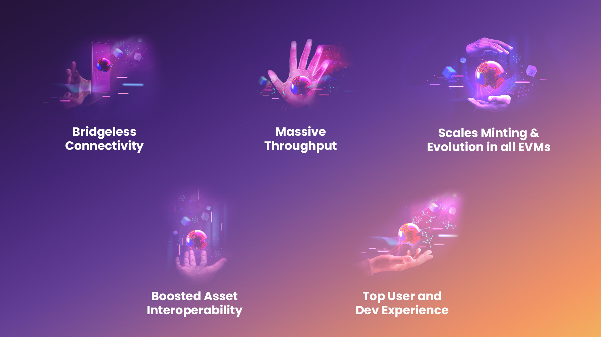

# ✅ LAOS Benefits

LAOS is transforming the way NFTs are created, managed, and interacted with, <mark style="color:green;">**encapsulated in 5 key benefits**</mark>.&#x20;

<figure><figcaption></figcaption></figure>

### **I. Goodbye **<mark style="color:green;">**Bridges**</mark>**. Hello **<mark style="color:green;">**Universals.**</mark>** Bridgeless Minting on Any Chain**

LAOS leverages both the recently built Universal Location for Cross Consensus Messaging (XCMv3) feature by Polkadot, as well as its core approach to fully separate asset ownership from asset attributes, to enable data to live and be managed in separate blockchains.&#x20;

Creators can mint and evolve assets using LAOS, and yet, instantly see and manage them as fully compliant ERC721/1155 tokens tradeable in any other blockchain, such as Ethereum, Polygon, Solana... and in a fully trustless way, with no bridges involved. Recipients of those NFTs are not forced to wrap their currencies, and can trade them as usual. These bridgelessly minted NFTs are starting be known as <mark style="color:green;">**Universals**</mark>.

For the first time, creators can have it all: highly scalable, decentralized, and on-chain certified minting & evolution, together with the advantages of the already-existing ecosystem in the blockchain of their choice.

### **II. Massive **<mark style="color:green;">**Throughput**</mark>

Scaling is a core requirement to enable NFT use cases beyond scarcity; what will Digital Ownership entail when the mass minting and evolution of assets, along with on-chain certification, become possible?

Leveraging recent advances across different fields within blockchain technology, LAOS brings to the world the first specialized Relay Chain, where specialized Parachains can connect. Overall LAOS will function as an entire Polkadot dedicated to all aspects of Digital Ownership.

LAOS architecture uses a shard-like scaling pattern, and leverages the split between asset ownership & attributes to create a pattern where new Evolution Chains can be spawned when reaching full capacity, as opposed to increasing gas price and creating congestion.&#x20;

In terms of performance, LAOS will eventually achieve a theoretical throughput on par with Polkadot's, which will boast an overall 200K-1M TPS after the incoming async backing upgrade.

Moreover, because of its native connection to Polkadot as a Parachain, users will benefit from a total combined number of 100K-1M TPS with fast finality, in an ecosystem with smart contracts, De-Fi, and data storage.

### **III. Boosted **<mark style="color:green;">**Asset Interoperability**</mark>

The promise of the Metaverse, as one where digital assets are interoperable, regardless of where they were acquired, is severely limited by different factors. LAOS introduces a novel protocol for Decentralized Asset Identity that, leveraging LAOS cross-chain connectivity, enables a multiplicity of novel use cases.

LAOS allows anyone, permissionlessly, to extend the metadata of any asset <mark style="color:green;">**in any blockchain**</mark>, mirroring the concept of claims in the Decentralized Identity frameworks. Likewise, DApps can consume asset metadata filtering only those sources they trust.

Developers are free to confer new attributes to the asset, including its image or render, and evolve them according to how they are used, without conflicting with the original asset definition. Even assets from existing famous collections can be revamped within this new framework and enjoy a new utility-based second life.

LAOS opens the door to the creation of novel <mark style="color:green;">**markets that incentivise DApps to accept foreign assets**</mark>, as exemplified in the [Use Cases section](use-cases.md).

### **IV. From **<mark style="color:green;">**Scarcity**</mark>** & **<mark style="color:green;">**Speculation**</mark>** to **<mark style="color:green;">**User-Generated Value**</mark>

This first wave of NFTs commonly utilized artificial scarcity to boost initial value, with purchasers speculating on reselling the same item for a greater profit.&#x20;

LAOS takes a radically different approach, creating an economy of User-Generated Value (UGV) where assets increase in value based on how they are used. LAOS Assets have the flexibility to evolve based on both off-chain activity (real-world events) and on-chain data.

By incentivizing users to engage with apps, video games, online and social media activity, and the broader ecosystem, LAOS Assets create an abundance mindset that drives user acquisition, retention, and loyalty.&#x20;

In this approach, minting & evolution scale, and the blockchain is used to certify the attributes of all assets, now, and in every past state, unlike traditional NFT storage that is often centralized on privately-owned servers.

### **V. **<mark style="color:green;">**Stop Asking**</mark>** Private Serves **<mark style="color:green;">**What It Is That You Own**</mark>

When transferring BTC or ETH, nobody is forced to ask a central party whether the initial payer had enough balance, or whether the transfer went through. The blockchain has this information, and everyone can ask in a decentralized way.&#x20;

When acquiring a traditional NFT, especially in NFTs with some dynamic features, this is typically not the case. Users can ask the blockchain who owns it, but they need to ask a centralized private server what they are buying, i.e., the attributes of the NFT.&#x20;

Should the private servers change, be hacked, or cease operations, the token data on the blockchain may simply end up linking to nothing and the value of the NFT would be zero.&#x20;

This aspect has remained as the elephant in the room until recently, because legislation is catching up with such centralized practices.&#x20;

Judges are starting to argue that, based on Howey’s test, NFTs within heavily centralized flows [must be considered securities](https://www.coindesk.com/consensus-magazine/2023/02/28/dapper-labs-nft-ruling-dunks-on-private-networks) because, among other aspects, “the expectation of profit is derived from the efforts of others”. NBA Top Shot’s (Dapper Labs) initial lawsuit may be followed by many others very soon.&#x20;
