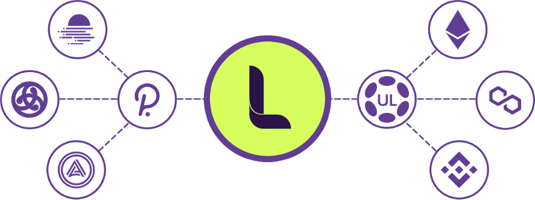

# 🖼️ Project Overview

LAOS aims to become the consensus system that every other chain uses to scale their Digital Ownership transactions, instantly and securely, without bridges, and in a truly non-custodial way, in contrast to highly centralized practices common today.

It embodies an  architecture planned for sharding-based scalability patterns, enabling currently mature ecosystems, such as Ethereum, Polygon, and their L2s, to offload a significant fraction of all their transactions, and support applications that unlock the full power of digital ownership, migrating from the current mindset of scarcity and speculation, to one of abundance and captured User Generated Value.

<figure><figcaption></figcaption></figure>

## Scale Digital Ownership in All Chains

With LAOS, creators can build on the blockchain of their choice, and scale the minting and evolution of assets in a <mark style="color:green;">**fully trustless**</mark> way, <mark style="color:green;">**with no bridges involved,**</mark> and <mark style="color:green;">**without forcing their users to wrap their tokens**</mark> or <mark style="color:green;">**buy new currencies.**</mark>

Games can mint millions of assets on Ethereum and Polygon, at minimal cost, allowing gamers to trade, lend, and amplify their assets using Ethereum's vast applications. They can unveil new engagement models, such as <mark style="color:green;">**User-Generated Value**</mark> <mark style="color:green;">**(UGV)**</mark>, whereby those millions of assets can evolve as designed by their creators, interact, and grow in value <mark style="color:green;">**based on their usage,**</mark> instead of speculation and scarcity.&#x20;

<mark style="color:green;">**Existing collections**</mark> from any blockchain are given a new lease of life, with their creators using LAOS to extend & evolve their initially static image & metadata, e.g., creating sponsored or seasonal campaigns. Marketplaces and explorers show the past and current states easily, <mark style="color:green;">**ensuring the collection's year-round relevance.**</mark>

NFT owners can maintain <mark style="color:green;">**full custody of what they own**</mark>, including their <mark style="color:green;">**assets’ properties**</mark>, and have the flexibility to move to other blockchains or marketplaces as needed.

At the heart of the technology is a radical <mark style="color:green;">**separation**</mark> between asset <mark style="color:green;">**ownership**</mark> and asset <mark style="color:green;">**attributes leveraging Polkadot latest developments,**</mark> whereby both sets of data can live and be managed by different consensus systems.

This leads to an architecture capable of providing <mark style="color:green;">**bridgeless minting**</mark>, and to scale beyond the possibilities of one single blockchain, enabling massive asset evolution with <mark style="color:green;">**on-chain certification**</mark>, <mark style="color:green;">**censorship resistance**</mark> and <mark style="color:green;">**fully decentralized data availability**</mark>.
