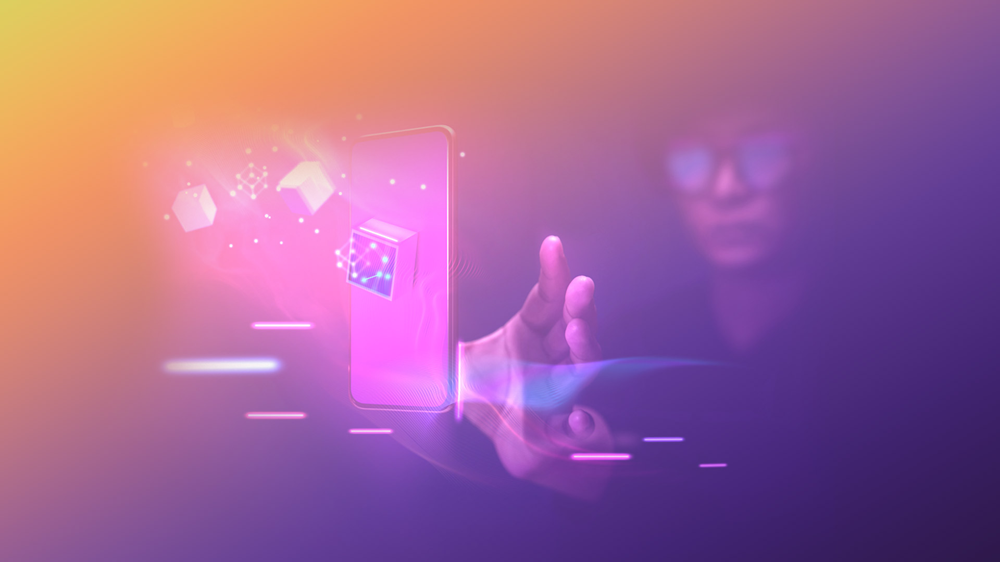

# 💡 Use Cases

<figure><figcaption></figcaption></figure>

\[<mark style="color:green;">**Gaming**</mark>] Using LAOS bridgeless minting and evolution, games can mint 100M+ assets on Ethereum, at minimal cost, allowing gamers to trade, lend, and amplify their assets using Ethereum's vast applications.

\[<mark style="color:green;">**Legendary Collectibles**</mark>] Existing collections are given a new lease of life, with their creators using LAOS to extend & evolve their initially static  image & metadata, e.g., creating sponsored or seasonal campaigns. Marketplaces and explorers show the past and current states easily, ensuring the collection's year-round relevance and continued value.

\[<mark style="color:green;">**Marketplace**</mark>] Leading NFT marketplaces attract more users by offering mass minting on Ethereum through no-code and API solutions. They absorb the minimal gas costs for all users meeting specific criteria and relays transactions to provide a gasless UX.

\[<mark style="color:green;">**Interoperability**</mark>] Games boost user acquisition & retention by letting players use assets from any blockchain. Users pay for imports via in-app purchases, after which the developer uses LAOS to permissionlessly extend metadata to match the game's style and introduces new attributes that are evolved within the game.

\[<mark style="color:green;">**Applications**</mark>] Developers protect themselves from legal issues regarding their assets being considered securities, by shifting their minting & evolution to LAOS. Now, rather than using private servers, the assets are stored securely on decentralized systems and can be verified on-chain.

\[<mark style="color:green;">**User Generated Content**</mark>] User customization of individual assets, certified on-chain via LAOS, makes them truly unique, ensuring their value is based on more than scarcity and speculation.

\[<mark style="color:green;">**Game Distribution Platforms**</mark>] Leading platforms partner with Copyright Offices to enforce asset copyright across all blockchains, using LAOS' Decentralized Identity.

