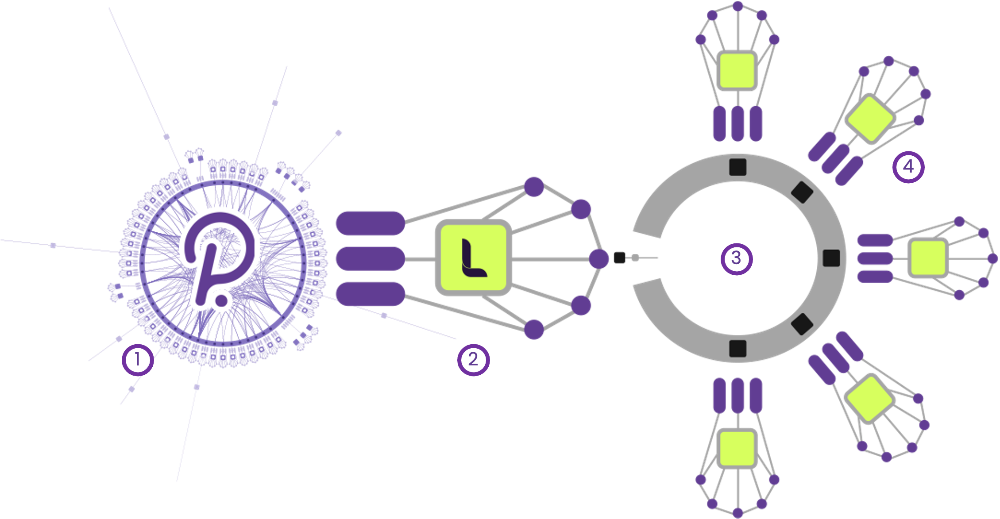

# ⛓️ Architecture

<figure><figcaption></figcaption></figure>

## Components&#x20;

LAOS will be built atop the <mark style="color:green;">**four distinct components**</mark> depicted in the above graphic. We hereby detail each component part in turn, and outline its role in powering the functioning LAOS ecosystem.&#x20;

<mark style="color:green;">**(1) Polkadot Relay Chain**</mark>

The root of the LAOS consensus protocol is Polkadot’s Relay Chain, which will provide <mark style="color:green;">**security to the LAOS Parachain from day one.**</mark>&#x20;

The Relay Chain's set of Polkadot validators provides security to the Parachain, ensuring that every transaction processed by the LAOS Parachain is valid. The Relay Chain also helps the Parachain transfer assets and connect functionalities in a fully trustless way via native Cross-Consensus Messaging (XCM), efficiently linking the light clients that Parachains have from other Parachains. This will allow LAOS to leverage core functionalities present in the Polkadot ecosystem, such as EVM-compatibility, DeFi and smart-contracts (e.g. from Moonbeam and Astar), data-availability specialized Parachains (e.g. Crust), and bridges to other blockchains.

<mark style="color:green;">**(2) LAOS Ownership Parachain**</mark>&#x20;

Playing host to the core LAOS-specific technical architecture is the <mark style="color:green;">**Ownership Parachain on Polkadot,**</mark> which sits one layer atop the Relay Chain.&#x20;

The Parachain will manage:&#x20;

* the LAOS token
* the ownership of assets not created via bridgeless patterns
* all trustless transfers of LAOS assets and LAOS utility tokens between LAOS and the broader Polkadot ecosystem
* the state and runtime of the LAOS Relay Chain, and all the EvoChains
* the governance of the entire LAOS ecosystem

<mark style="color:green;">**(3) LAOS Specialized Relay Chain**</mark>&#x20;

Connected to the Ownership Parachain via one single trustless bridge, and providing security to the Evochains sits a specialized, limited-functionality, version of Polkadot's Relay Chain. Both chains at the end of the bridge run a light-client of each other, ensuring that their full states are mutually known in a permissionless way.

The LAOS Relay Chain runtime upgrades are orchestrated by the Ownership chain via XCM commands across the trustless bridge. Likewise, this Relay Chain will not have a native token; it's economy will use LAOS tokens reserve transferred from the the Ownership Parachain.

In turn the LAOS Relay Chain will provide security to its Parachains following exactly the same pattern as Polkadot's Relay Chain.

<mark style="color:green;">**(4) LAOS EvoChains**</mark>

LAOS Assets are <mark style="color:green;">**created and evolved in the LAOS EvoChains.**</mark>

LAOS EvoChains are connected to the LAOS Relay Chain via the standard Polkadot's Parachain pattern. They have a specialized nature too: they share the same runtime, which is orchestrated by the LAOS Relay Chain.

Upon reaching saturation, new identical EvoChains will be spawned, enhancing capacity and ensuring optimal performance, thus paving the way for massive scaling in the dynamic NFT landscape.


🔗 **Technical Whitepaper:** For a complete exploration of all technical aspects of our product, including its structure, functionality, integrations, and future developments, please refer to our detailed [technical whitepaper](https://github.com/freeverseio/laos-whitepaper/blob/main/laos.pdf).

