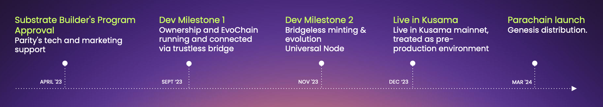

# 🎯 Development Milestones

LAOS MVP is close to being feature complete. The MVP will be deployed to Kusama before end of 2023, as a step prior to acquiring a Parachain slot in Polkadot, and launching to mainnet before March 2024.

LAOS maintains a public [high-level roadmap](https://github.com/freeverseio/LAOS-roadmap) as well as a detailed SCRUM [project board](https://github.com/orgs/freeverseio/projects/3/views/2), aimed at providing transparency about the Engineering progress, and facilitate contributions.

<figure><figcaption></figcaption></figure>

### 🏗️  **Substrate Builder Program Approval - April '23**

LAOS development effort started in early 2023, and the project was later accepted into the Polkadot's Substrate Builders Program in April 2023, guarantees Parity's tech, code audits, and marketing support for the development of the LAOS network.&#x20;

### :chains: **Development Milestone 1 - Sept '23**

<figure><figcaption></figcaption></figure>

**Status:** Milestone successfully achieved, reviewed by Parity.

**Objective:** The creation of core basic infrastructure for the LAOS network.&#x20;

**Overview:** The primary goals are to create the LAOS ownership chain (ownChain) as a parachain of Rococo, and create the first LAOS evolution chain (evoChain). A bi-directional trustless bridge will be installed to enable cross-chain communication, allowing the ownership chain to govern the evolution chain. This bi-directional bridge will sit between Rococo and the LAOS ownership chain. During the initial phase, the LAOS evolution chain will sit as a solochain based on the [substrate node template](https://github.com/substrate-developer-hub/substrate-node-template), to be later connected via the installation of a light client in the ownership chain. Finally, this development phase will conclude with the enabling of bidirectional communication  of the LAOS chain through trustless bridges through to all aspects of the EvoChain as illustrated in the above graphic.&#x20;

**Deliverables:**&#x20;

* Create the LAOS Ownership chain node (ownChain)
* Create the LAOS Evolution Chain node (evoChain)&#x20;
* Connect via solochain-parachain bidirectional bridge

### 🚀 Development Milestone 2 **- Dec '23**

<figure><figcaption></figcaption></figure>

**Status:** In progress. On track for deadline.

**Objective:** The implementation of core basic infrastructure for LAOS Assets. &#x20;

**Overview:** Primary goals will include enabling LAOS to create collections, transfer LAOS Assets, evolve the assets' metadata, generate proofs, and verify assets metadata via provision of Merkle proofs. As such, the compatibility layer with the ERC721 standard will also be integrated to provide an Ethereum JSON-RPC API for the compatibility of incumbent DApps (eg. Metamask).&#x20;

This phase will also include business logic for creating collections and managing their evolution. We will develop a LAOS Assets ownership pallet based on the NFTs pallet and integrate it into the ownership chain. Additionally, we will develop a LAOS Assets evolution pallet and integrate it into the evolution chain. This will allow the creation and evolution of collections.

**Deliverables:**&#x20;

* Development & integration of LAOS Assets ownership pallet on ownChain and evoChain
* Introduce LAOS ERC721 node&#x20;
* Generate & verify proof of existence of assets metadata

### 🌐 Development Milestone 3 **- Mar '24**

**Status:** Not started.

**Objective:** The finalization of core infrastructure for LAOS network.

**Overview:** Specifically, this phase will prioritize cross-chain communication with sibling parachains, conduct a thorough code audit, and make preparations for the stable release of the code. We will also create a dynamic asset marketplace to demonstrate the system's capabilities. Finally, we will enable staking and transition from sudo to a more decentralized governance system. To enable a functioning LAOS token, this phase will implement the XC-20 protocol for reserve transfer and activate the XCMv3 primitives to control LAOS Assets from sibling parachains. Additionally, we will create the second LAOS evolution chain and integrate means to move collections among evoChains.

**Deliverables:**&#x20;

* Implement XC-20 protocol&#x20;
* stable release of LAOS ownership node, evolution node, ERC721 node, bridge
* Enable staking&#x20;
* Cross-chain integration


🗒 **Development Notes:** The LAOS team follows the Scrum methodology, conducting sprint cycles lasting two weeks. All software developed as part of the LAOS Parachain project is released as open-source under an appropriate license.

