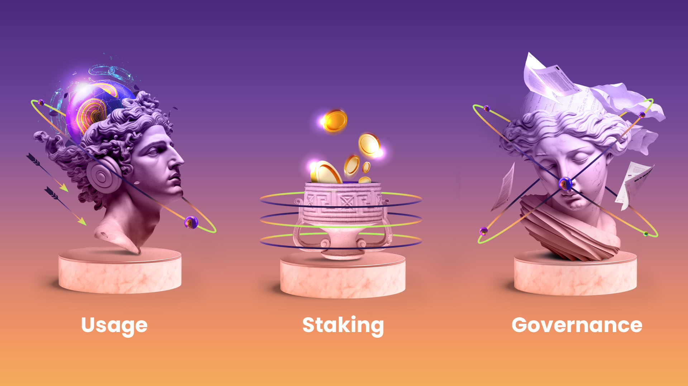

# 🪙 LAOS Utility Token

## LAOS Token Overview

The LAOS utility token will <mark style="color:green;">**empower the entirety of the LAOS ecosystem**</mark> to operate securely, efficiently and fairly. The LAOS token is instrumental and inextricable from the facilitating of core functions of the LAOS ecosystem. Stakeholders at each substrate of the LAOS infrastructure stack interact with the token in their respective capacities, rendering the token an <mark style="color:green;">**invaluable tool in aligning incentives across the ecosystem.**</mark>&#x20;

Ultimately, LAOS will operate as the consensus system that every other chain uses to scale their Digital Ownership transactions, <mark style="color:green;">**independent of centralized oversight and control.**</mark> This described democratization of ownership requires the implementation of a powerful tool which can both operate as a <mark style="color:green;">**medium of exchange for users of the platform, security, and a fairly distributed marker of future decision-making**</mark>. The LAOS token is specifically designed with these different, yet essential, objectives in mind.&#x20;

<figure><figcaption></figcaption></figure>

## LAOS Token Utility&#x20;

While the LAOS token is necessarily pervasive throughout the LAOS ecosystem (& beyond), its core functionality can be refined to three utilizations.&#x20;

The <mark style="color:green;">**LAOS utility token powers the minting and evolution of assets,**</mark> regardless of the blockchain of choice. Further, it <mark style="color:green;">**distributes decision-making power from a centralized structure to an entire community**</mark>, enabling token holders to vote on key protocol decisions.

A breakdown of the three primary utilizations of the LAOS token:&#x20;

<mark style="color:green;">**Usage**</mark>&#x20;

LAOS is needed to execute transactions, both in the Ownership, the LAOS Relay Chain, and the Evolution Chains. Specifically, any trading, minting and subsequent modification of LAOS Assets requires network transaction fees to be paid in the native LAOS token.&#x20;

<mark style="color:green;">**Staking**</mark>

Underpinning the security of the network, validators receive rewards in LAOS tokens upon the inclusion of new valid blocks in the Ownership Chain. Additionally, delegators can stake their LAOS to unlock a range of benefits, including additional token rewards and governance rights, while helping preserve the security of the network.&#x20;

<mark style="color:green;">**Governance**</mark>

Any stakeholder in possession of LAOS tokens assumes the privilege to participate in LAOS network governance. This token model brings about incentive alignment across different stakeholders by allowing participation in the future direction of LAOS through proposals, discussions, and voting. True to the ethos of decentralization, the distributed set of token holders corresponds to an accordingly distributed set of voting power. As such, from the moment of LAOS decentralization, the community will be collectively responsible for monitoring, assessing, and actioning governance decisions.&#x20;

## Improving the Token Ecosystem

LAOS is a continually evolving system with ongoing enhancements to its economic design, aiming to provide the best user experience for all network participants. The <mark style="color:green;">**changes to the protocol will be managed by the LAOS DAO**</mark>, and all community members are warmly encouraged to partake in the process.&#x20;
