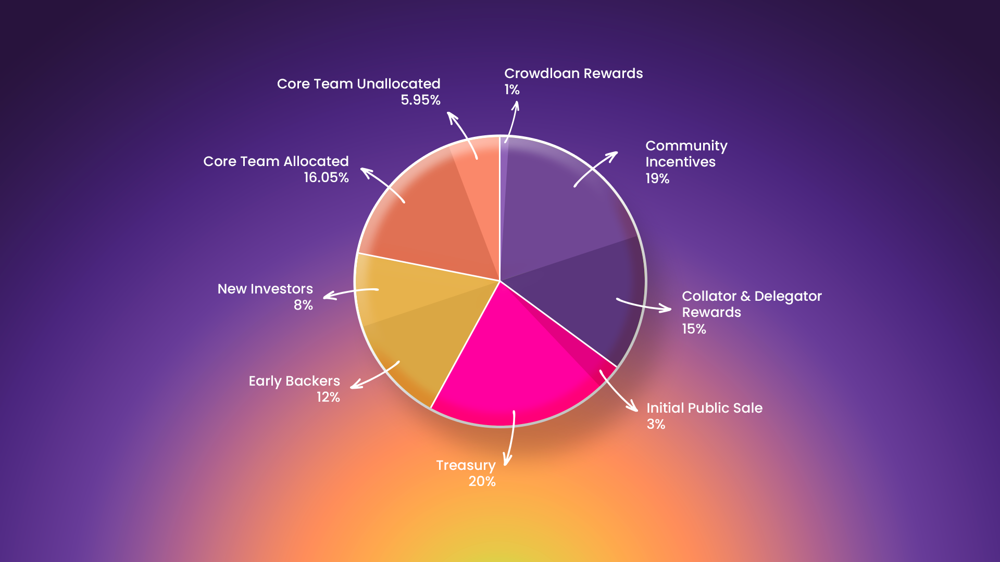
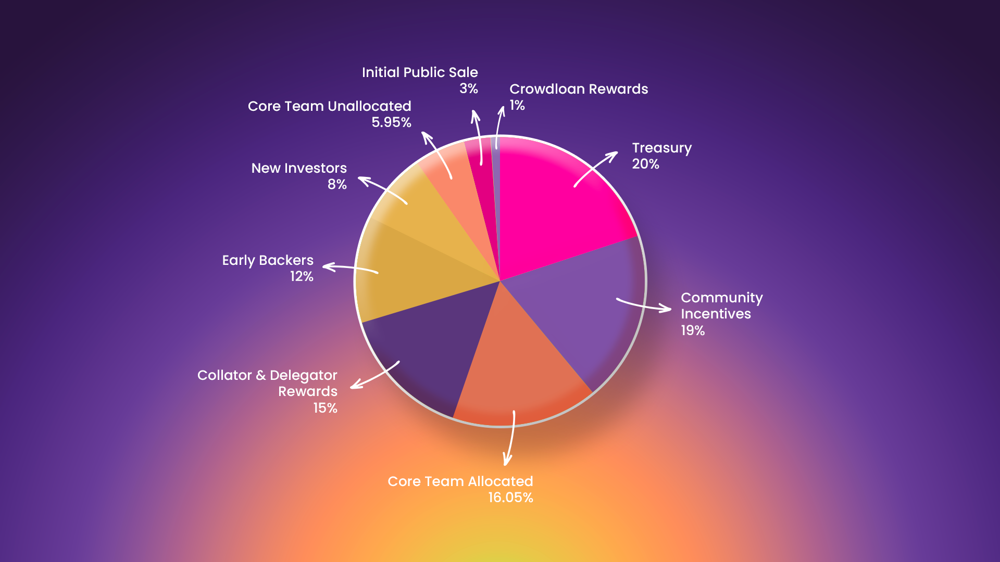
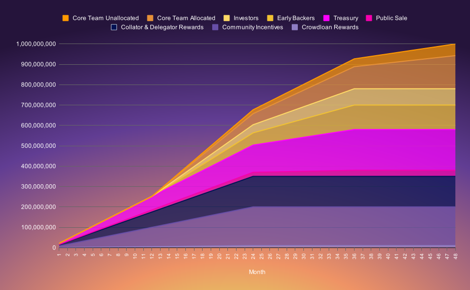

# ⚖️ Token Distribution

At genesis, the LAOS Foundation will create an <mark style="color:green;">**initial total token supply of 1,000,000,000 LAOS**</mark> tokens. The LAOS token allocation is designed to ensure a fair and balanced distribution that <mark style="color:green;">**supports both the development and longevity of LAOS**</mark>. We aim to <mark style="color:green;">**stimulate active participation, reward contributors, and incentivize stakeholders**</mark> in a manner that aligns with our community-centric ethos.

The LAOS token vesting process utilizes a release schedule to <mark style="color:green;">**maintain the project's long-term stability**</mark>. This schedule outlines the timeline for tokens allocated to various stakeholders to gradually become accessible. This approach <mark style="color:green;">**safeguards against sudden market flooding, encourages ongoing commitment, and protects the LAOS token value**</mark>. It embodies our commitment to transparency, fairness, and sustainable growth within our ecosystem.

## LAOS Token Allocation&#x20;

The initial Tokenomics paper outlined four main pools: the <mark style="color:green;">**Investors pool**</mark>, the <mark style="color:green;">**Community Incentives & Distribution pool,**</mark>  the <mark style="color:green;">**Treasury Pool**</mark> and the <mark style="color:green;">**Core Team pool**</mark>. These pools each have specific vesting conditions, which are detailed in the section below.&#x20;

Following the winning of a parachain slot, the completion of the genesis runtime development, and preparations for the public sale, greater clarity has been achieved. Consequently, these pools have been further subdivided while adhering to the original vesting conditions. The following pie chart shows the subdivision of each of the four main pools.

<figure><figcaption>
Main pools grouped by common vesting conditions
</figcaption></figure>

 

<figure><figcaption>
Main pools sorted clockwise by size
</figcaption></figure>

The following table specifies the vesting conditions for each pool, sorted by increasing length of the total lockup period:

<table><thead><tr><th width="143">Pool</th><th width="101" align="center">%</th><th width="148" align="center">Cliff (months)</th><th width="166" align="center">Vesting (months)</th><th align="center">Total Lockup</th><th data-hidden align="center">Tokens</th></tr></thead><tbody><tr><td>Crowdloan Rewards</td><td align="center">1.0%</td><td align="center">0</td><td align="center">24</td><td align="center">2 years</td><td align="center"></td></tr><tr><td>Community Incentives</td><td align="center">19.0%</td><td align="center">0</td><td align="center">24</td><td align="center">2 years</td><td align="center"></td></tr><tr><td>Collator &#x26; Delegator Rewards</td><td align="center">15.0%</td><td align="center">0</td><td align="center">24</td><td align="center">2 years</td><td align="center"></td></tr><tr><td>Initial Public Sale</td><td align="center">3.0%</td><td align="center">0</td><td align="center">36</td><td align="center">3 years</td><td align="center"></td></tr><tr><td>Treasury</td><td align="center">20.0%</td><td align="center">0</td><td align="center">36</td><td align="center">3 years</td><td align="center"></td></tr><tr><td>Early Backers</td><td align="center">12.0%</td><td align="center">12</td><td align="center">24</td><td align="center">3 years</td><td align="center"></td></tr><tr><td>New Investors</td><td align="center">8.0%</td><td align="center">12</td><td align="center">24</td><td align="center">3 years</td><td align="center"></td></tr><tr><td>Core Team Allocated</td><td align="center">16.05%</td><td align="center">12</td><td align="center">36</td><td align="center">4 Years</td><td align="center">162,5M</td></tr><tr><td>Core Team Unallocated</td><td align="center">5.95%</td><td align="center">12</td><td align="center">36</td><td align="center">4 Years</td><td align="center">57,5M</td></tr></tbody></table>

## Objectives of Each Pool

* The <mark style="color:green;">**Crowdloan Rewards pool**</mark> (\~1%) is set aside for rewards related to Crowdloan contributions, reflecting the 100 LAOS per DOT for nearly 100,000 DOT contributed.&#x20;
* The <mark style="color:green;">**Community Incentives pool**</mark> (19%) is allocated for incentivizing projects and developers to build on LAOS, as well as to enhance LAOS' visibility. Examples of envisaged usage of this pool include incentivizing support for Bridgeless Minting in popular marketplaces in Ethereum or Polygon, development grants for DApps that use LAOS, as well as meaningful marketing initiatives, community growth, and presentation of LAOS possibilities in relevant conferences. Upon decentralization of governance, this pool will be managed by the LAOS community.
* The <mark style="color:green;">**Collator Incentives pool**</mark> (15%) is earmarked for programatically distributing collator and delegator incentives over the first two years, at a rate of 7.5% annually (see [Collator Incentives section](collator-incentives.md) for more details).&#x20;
* The <mark style="color:green;">**Public Sale Pool**</mark> (3%) holds the designated tokens aimed for the Public Sale. Note that undistributed tokens from the New Investors pool may be added to potential Public Sales.
* The[^1] <mark style="color:green;">**Treasury Pool**</mark> (20%) is allocated to support core ecosystem growth, core protocol development, and to cover legal and operational expenses. Upon decentralizing governance, control of the treasury will transfer to the LAOS community.
* The <mark style="color:green;">**Early Backers pool**</mark>  (12%) contains the allocation for early investors that funded the development of LAOS, from inception to its genesis event.
* The <mark style="color:green;">**New Investors pool**</mark>  (8%) contains the allocation for the maximum amount that can be used in the ongoing token private sale (up to 8%), allocated proportionally to participants. Any undistributed tokens will be reserved for potential future fundraising rounds or a public sale.
* The <mark style="color:green;">**Core Team Initial Allocation pool**</mark> (16.05%) is assigned to current core contributors to LAOS, including core protocol development as well as initial onboarding tools aimed at showing its possibilities to potential new DApp developers. Note that token vesting in this pool is conditional on the core contributor's continued involvement throughout the vesting period.
* The <mark style="color:green;">**Core Team Unallocated pool**</mark> (5.95%) serves the same purpose as the initially allocated part, but it is aimed to be used for future core contributors. It will be managed once governance is decentralized.

## LAOS Token Vesting  

Given the vesting conditions of each pool, the following chart illustrates the evolution of the total amount of LAOS tokens vested per month over the first four years post-launch:

<figure><figcaption>
Evolution of the total amount of LAOS Tokens (vertical axis) vested per month, grouped by pool.
</figcaption></figure>

The following plot highlights a relevant aspect of the vesting conditions. The <mark style="color:green;">**commitment to early decentralization becomes evident when analyzing the circulating supply**</mark>. Initially, the liquid token supply is fully in the hands of the community. As tokens allotted to investors and core team members progressively unlock, the community's share incrementally decreases. However, it always maintains at least 60%, <mark style="color:green;">**ensuring LAOS remains sufficiently decentralized at all times**</mark>.&#x20;

<figure><figcaption>
This plot shows the circulating supply on the vertical axis and time in months on the horizontal axis, categorized into two main groups. The 'Community' group includes Crowdloan Rewards, Community Incentives, Collator Incentives, Public Sale, and Treasury pools. The 'Insider' group comprises Early Backers, Investors, and both Core Team pools.
</figcaption></figure>

[^1]: 
